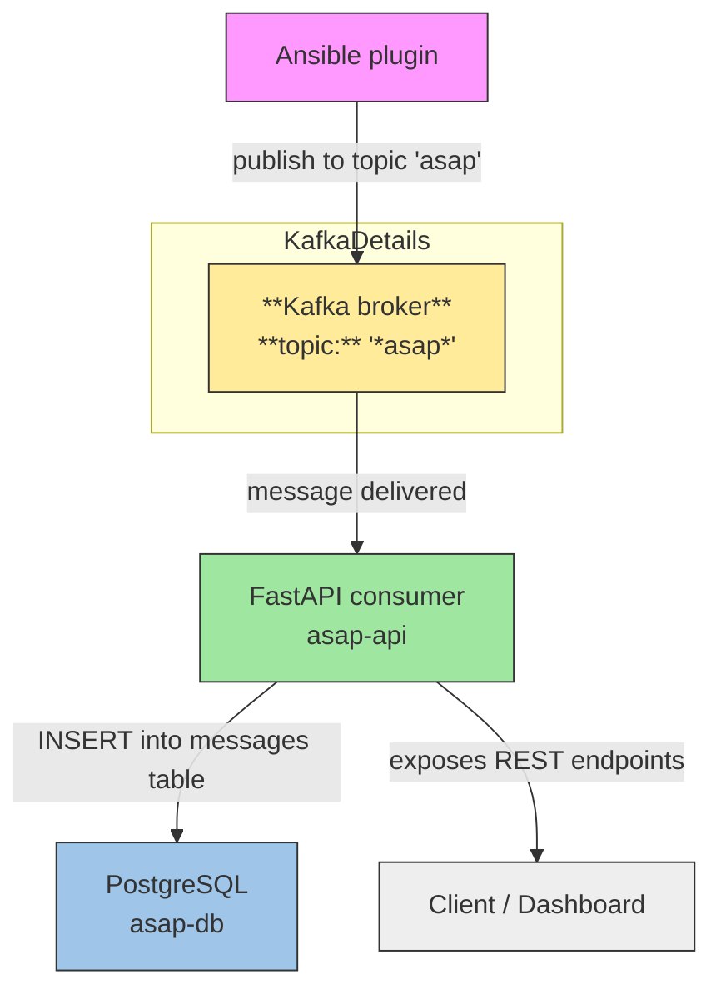

# ASAP Initiative Development Stack

[](https://www.bestpractices.dev/projects/11342)
[](https://scorecard.dev/viewer/?uri=github.com/ASAP-Initiative/asap-dev-stack)

This project provides a Docker Compose setup for building and running containers for the [ASAP Initiative](https://github.com/ASAP-Initiative) development stack. 

This development stack includes :
* asap-api
* asap-cli
* asap-web
* linux distributions:
  * Debian
  * Fedora
  * Ubuntu

## Project Structure

- **[docker-compose.yml](docker-compose.yml)**: Defines the services for each operating system using the respective Dockerfiles.
- **[os/](os/)**: Contains subdirectories for each operating system with their respective Dockerfiles.
  - **[debian/](os/debian/)**: Dockerfiles for Debian  versions (11, 12, 13).
  - **[fedora/](os/fedora/)**: Dockerfiles for Fedora versions (39, 40, 41, 42).
  - **[ubuntu/](os/ubuntu/)**: Dockerfiles for Ubuntu LTS versions (18.04, 20.04, 22.04, 24.04).
- **[README.md](README.md)**: Documentation for the project.


## The Stack

| Service | Container name | Hostname | Image | Exposed ports | Build context / Dockerfile |
|---|----|---|---|----|---|
| asap-cli | asap-dev-asap-cli | asap-cli | asap-cli:latest | (none) | ./asap-cli / [Dockerfile](./asap-cli/Dockerfile) |
| asap-kafka-consumer | asap-dev-asap-kafka-consumer | asap-kafka-consumer | asap-api:latest | 8000 | ./asap-api / [Dockerfile](./asap-api/Dockerfile) |
| asap-db | asap-db | asap-db | postgres:15 | 5432 | (image) |
| kafka-broker | asap-dev-kafka-broker | kafka-broker | apache/kafka:latest | 9092 | (image) |
| debian11 | asap-dev-debian11 | debian11 | asap-dev-debian:11 | 22 | ./os/debian / [Dockerfile.debian11](./os/debian/Dockerfile.debian11) |
| debian12 | asap-dev-debian12 | debian12 | asap-dev-debian:12 | 22 | ./os/debian / [Dockerfile.debian12](./os/debian/Dockerfile.debian12) |
| debian13 | asap-dev-debian13 | debian13 | asap-dev-debian:13 | 22 | ./os/debian / [Dockerfile.debian13](./os/debian/Dockerfile.debian13) |
| fedora39 | asap-dev-fedora39 | fedora39 | asap-dev-fedora:39 | 22 | ./os/fedora / [Dockerfile.fedora39](./os/fedora/Dockerfile.fedora39) |
| fedora40 | asap-dev-fedora40 | fedora40 | asap-dev-fedora:40 | 22 | ./os/fedora / [Dockerfile.fedora40](./os/fedora/Dockerfile.fedora40) |
| fedora41 | asap-dev-fedora41 | fedora41 | asap-dev-fedora:41 | 22 | ./os/fedora / [Dockerfile.fedora41](./os/fedora/Dockerfile.fedora41) |
| fedora42 | asap-dev-fedora42 | fedora42 | asap-dev-fedora:42 | 22 | ./os/fedora / [Dockerfile.fedora42](./os/fedora/Dockerfile.fedora42) |
| ubuntu1804 | asap-dev-ubuntu1804 | ubuntu1804 | asap-dev-ubuntu:18.04 | 22 | ./os/ubuntu / [Dockerfile.ubuntu1804](./os/ubuntu/Dockerfile.ubuntu1804) |
| ubuntu2004 | asap-dev-ubuntu2004 | ubuntu2004 | asap-dev-ubuntu:20.04 | 22 | ./os/ubuntu / [Dockerfile.ubuntu2004](./os/ubuntu/Dockerfile.ubuntu2004) |
| ubuntu2204 | asap-dev-ubuntu2204 | ubuntu2204 | asap-dev-ubuntu:22.04 | 22 | ./os/ubuntu / [Dockerfile.ubuntu2204](./os/ubuntu/Dockerfile.ubuntu2204) |
| ubuntu2404 | asap-dev-ubuntu2404 | ubuntu2404 | asap-dev-ubuntu:24.04 | 22 | ./os/ubuntu / [Dockerfile.ubuntu2404](./os/ubuntu/Dockerfile.ubuntu2404) |

## The Workflow



## Getting Started

0. **Prerequisites**:

   - Ensure you have [Docker](https://docs.docker.com/get-docker/) and [Docker Compose](https://docs.docker.com/compose/install/) installed on your machine.

1. **Clone the Repository**: 

   ```bash
   # Clone asap-api in order to build the asap-kafka-consumer image
   git clone https://github.com/ASAP-Initiative/asap-api.git

   git clone https://github.com/ASAP-Initiative/asap-dev-stack.git
   cd asap-dev-stack
   ```

2. **Build the Docker Images**:

   ```bash
   docker compose build
   ```

3. **Run the Stack**: 

   ```bash
   docker compose up -d
   ```

4. **Play with the stack**: 

   ```bash
   docker exec -it asap-dev-asap-cli bash -c 'ansible --version && ansible all -m ping'
   ansible [core 2.16.14]
      config file = None
      configured module search path = ['/home/ansible/.ansible/plugins/modules', '/usr/share/ansible/plugins/modules']
      ansible python module location = /usr/local/lib/python3.12/site-packages/ansible
      ansible collection location = /home/ansible/.ansible/collections:/usr/share/ansible/collections
      executable location = /usr/local/bin/ansible
      python version = 3.12.12 (main, Oct  9 2025, 22:40:55) [GCC 14.2.0] (/usr/local/bin/python)
      jinja version = 3.1.6
      libyaml = True
   debian12 | SUCCESS => {
        "changed": false,
        "ping": "pong"
   }
   debian11 | SUCCESS => {
        "changed": false,
        "ping": "pong"
   }
   fedora39 | SUCCESS => {
        "changed": false,
        "ping": "pong"
   }
   fedora40 | SUCCESS => {
        "changed": false,
        "ping": "pong"
   }
   debian13 | SUCCESS => {
        "changed": false,
        "ping": "pong"
   }
   ubuntu1804 | SUCCESS => {
        "changed": false,
        "ping": "pong"
   }
   fedora41 | SUCCESS => {
        "changed": false,
        "ping": "pong"
   }
   ubuntu2004 | SUCCESS => {
        "changed": false,
        "ping": "pong"
   }
   fedora42 | SUCCESS => {
        "changed": false,
        "ping": "pong"
   }
   ubuntu2204 | SUCCESS => {
        "changed": false,
        "ping": "pong"
   }
   ubuntu2404 | SUCCESS => {
        "changed": false,
        "ping": "pong"
   } 
   ```


## Note about Ansible version

In order to work with **Ubuntu 18.04 (with Python 3.6)**, we cannot install `ansible-core > 2.16` ([ansible-core support matrix](https://docs.ansible.com/ansible/latest/reference_appendices/release_and_maintenance.html#ansible-core-support-matrix)), so we use `ansible==9.13` ([Ansible community chnagelogs](https://docs.ansible.com/ansible/latest/reference_appendices/release_and_maintenance.html#ansible-core-support-matrix)).

## Contributing

See [CONTRIBUTING.md](CONTRIBUTING.md) for guidelines on contributing to this project.

## License

This project is licensed under the [MIT License](LICENSE).
